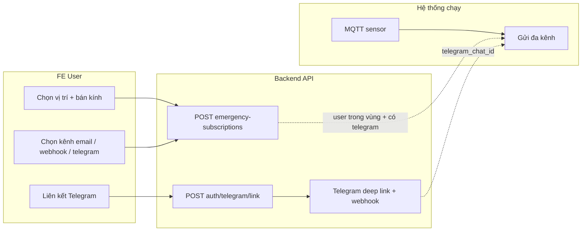

# Nghiệp vụ & hướng dẫn FE — các luồng theo `enhancement-roadmap.md`

Tài liệu này mô tả **nghiệp vụ** các mục đã/đang có trong roadmap (A1–D2, B1–B3), **API backend** tương ứng, và **gợi ý tích hợp FE** — tách rõ **người dùng (User)** vs **quản trị (Admin)**. Base URL ví dụ: `https://api.floodsight.id.vn` (thay bằng môi trường thật).

**Auth chung**

- User/Admin đăng nhập: `POST /api/auth/login` → lưu `access_token` (JWT), `refresh_token`, `session_token`.
- Gọi API cần bảo vệ: header `Authorization: Bearer <access_token>`.
- Swagger: `/api-docs` — bấm **Authorize** trước khi thử endpoint có `bearerAuth`.

---

## 1. Bản đồ mã roadmap → API & đối tượng FE

| Mã | Nội dung | API chính (prefix `/api`) | FE User | FE Admin |
|----|-----------|---------------------------|---------|----------|
| **A1** | Fusion cảm biến + crowd | `GET /v1/fusion/points` | Bản đồ / popup điểm hợp nhất | (Tuỳ) xem cùng dữ liệu hoặc debug |
| **A2** | Độ tin cậy báo cáo | `GET /crowd-reports`, `GET /crowd-reports/all`, `GET /reports/all`, `GET /reports/pending`, sau `PUT /reports/:id/moderate` — trường `confidence`, `confidence_breakdown` | Danh sách báo cáo công khai: badge/màu | Moderator: duyệt + thấy confidence |
| **A3** | Dự báo ngắn hạn | `GET /v1/forecast/sensor/:sensorId?horizon=&sample_minutes=` | Tooltip/badge theo sensor | Dashboard sensor (tuỳ) |
| **B1** | Health thiết bị | `GET /v1/admin/devices/health` | — | **Admin JWT** — bảng online/degraded/offline |
| **B2** | Idempotency MQTT | (Server + DB `ingest_key`) | Không gọi API riêng | Ops/migration; không màn FE bắt buộc |
| **B3** | Rate limit báo cáo | `POST /report-flood` | Form báo cáo: xử lý **429** + thông báo “thử lại sau” | Giống user nếu test; hiểu giới hạn IP |
| **C1** | Thông báo đa kênh | `POST /auth/telegram/link`, `GET /auth/telegram/status`, `DELETE /auth/telegram/unlink`; `POST/GET/PUT/DELETE /emergency-subscriptions/...`; `POST /v1/telegram/webhook` (**Telegram gọi**, không JWT) | Cài đặt: liên kết Telegram + đăng ký vùng + chọn kênh | `GET /v1/admin/emergency-alerts/summary?hours=` |
| **C2** | Heatmap + timeline 24h | `GET /heatmap`, `GET /heatmap/combined`, `GET /heatmap/timeline-24h` | Bản đồ nhiệt + biểu đồ 24h | Trang thống kê / demo |
| **D1** | Đánh giá MAE/RMSE | `GET /v1/research/evaluation` | (Tuỳ) trang “minh họa nghiên cứu” | Trang báo cáo / export số liệu |
| **D2** | Cold-start hotspots | `GET /v1/research/cold-start-hotspots` | (Tuỳ) overlay “vùng thiếu sensor” | Báo cáo / slide |

Ghi chú: các route trên gắn với `app.use('/api', ...)` nên đường dẫn đầy đủ là `/api` + bảng (ví dụ `/api/v1/fusion/points`).

---

## 2. Nhóm A — Nghiệp vụ chi tiết & FE

### A1 — Fusion điểm (`GET /api/v1/fusion/points`)

**Nghiệp vụ:** Gom cảm biến gần nhất với từng báo cáo đám đông đã duyệt; tính `fused_cm`, trọng số, loại `coverage` (`blended` | `crowd_only_far` | `crowd_only_no_sensor`). Cảm biến trả thêm mức chỉ-sensor vs fused tại trạm.

**FE User**

- Gọi API định kỳ hoặc theo viewport bản đồ (debounce).
- Vẽ lớp điểm crowd: màu/icon theo `coverage` hoặc so sánh `crowd_only_cm` vs `fused_cm`.
- Env backend (ops): `FUSION_R_MAX_M`, `FUSION_DECAY_DIST_M`, `FUSION_DISAGREE_SCALE_CM` — không cần hiển thị user; có thể ghi chú trong trang “Giới thiệu kỹ thuật”.

**FE Admin**

- Không bắt buộc; có thể dùng cùng API để demo nội bộ.

---

### A2 — Confidence báo cáo (trường JSON)

**Nghiệp vụ:** Mỗi báo cáo trong các list/pending được gắn `confidence` (0–100) và `confidence_breakdown` (giải thích nhẹ) khi trả JSON — không đổi flow tạo báo cáo.

**FE User**

- `GET /api/crowd-reports` (public): hiển thị badge “độ tin cậy” hoặc thanh màu.
- Tooltip/popover đọc `confidence_breakdown` nếu có.

**FE Admin / Moderator**

- `GET /api/reports/pending`, `PUT /api/reports/:id/moderate`: sau duyệt vẫn có confidence trong response (theo backend).
- `GET /api/crowd-reports/all`, `GET /api/reports/all`: lọc/sắp xếp theo `confidence` nếu cần.

---

### A3 — Dự báo ngắn hạn (`GET /api/v1/forecast/sensor/:sensorId`)

**Nghiệp vụ:** Hồi quy tuyến tính trên `flood_logs` trong cửa sổ `sample_minutes`; horizon 15–120 phút; trả vận tốc, mực dự báo, ước lượng phút tới ngưỡng warning/danger nếu xu hướng tăng.

**Query:** `horizon` (mặc định 60), `sample_minutes` (mặc định 90).

**FE User**

- Trên marker sensor hoặc panel chi tiết: badge “Dự báo ~X phút” / cảnh báo sớm từ cờ `predicted_*` (theo schema response thực tế trong Swagger).

**FE Admin**

- Tuỳ chọn: cùng widget trên trang giám sát trạm.

---

## 3. Nhóm B — Nghiệp vụ & FE

### B1 — Device health (`GET /api/v1/admin/devices/health`)

**Nghiệp vụ:** Phân loại trạm theo thời gian đo cuối trong `flood_logs` / `energy_logs`; ngưỡng phút từ env `HEALTH_ONLINE_MAX_MINUTES`, `HEALTH_DEGRADED_MAX_MINUTES`.

**FE User:** không dùng (chỉ admin).

**FE Admin**

- Trang “Sức khỏe thiết bị”: bảng + lọc `online` | `degraded` | `offline` | `inactive`.
- JWT **role admin**.

---

### B2 — Idempotency MQTT (`ingest_key`)

**Nghiệp vụ:** Tránh ghi trùng `flood_logs` khi MQTT gửi lặp; worker set `ingest_key`, DB unique `(sensor_id, ingest_key)`.

**FE:** không có API riêng cho user; vận hành chạy migration `migrate:flood-ingest-key`. FE chỉ hưởng dữ liệu sạch hơn.

---

### B3 — Rate limit `POST /api/report-flood`

**Nghiệp vụ:** Giới hạn số request theo IP trong cửa sổ thời gian (`REPORT_FLOOD_WINDOW_MS`, `REPORT_FLOOD_MAX_PER_WINDOW`).

**FE User**

- Khi **HTTP 429**: hiển thị thông báo thân thiện (“Bạn gửi quá nhiều, vui lòng thử lại sau X phút”) — đọc header `Retry-After` nếu backend gửi (hoặc message body nếu có).
- Không spam nút Gửi; disable trong vài giây sau submit.

**FE Admin:** không riêng; moderator vẫn tạo báo cáo qua cùng endpoint nếu test → cùng rule IP.

---

## 4. Nhóm C — Nghiệp vụ & FE

### C1 — Thông báo đa kênh (email / webhook / Telegram)

**Nghiệp vụ tổng quát**

1. MQTT xử lý sensor → khi `danger` hoặc (`warning` và `velocity > 5`) → tìm subscriber trong bán kính (`emergency_subscriptions` + PostGIS).
2. Với mỗi subscriber, đọc `notification_methods`; gửi từng kênh đã bật (email / webhook / telegram).
3. Dedupe: đã gửi **thành công** cùng `sensor + user + alert_kind` trong `EMERGENCY_ALERT_COOLDOWN_MINUTES` thì bỏ qua; có retry nhẹ từng kênh.
4. **Telegram chat riêng:** user liên kết bot → `users.telegram_chat_id`; fallback `TELEGRAM_CHAT_ID` env nếu chưa liên kết.

**Luồng User — Liên kết Telegram**

| Bước | Method | Path | Body / ghi chú |
|------|--------|------|-----------------|
| 1 | `POST` | `/api/auth/telegram/link` | `{}` hoặc không body; **Bearer JWT** |
| 2 | (Điện thoại) Mở `data.deep_link` → Start bot | — | Deep link có `/start <token>` |
| 3 | `GET` | `/api/auth/telegram/status` | Bearer |
| 4 | (Tuỳ) `DELETE` | `/api/auth/telegram/unlink` | Bearer — gỡ liên kết |

**Lưu ý FE:** `GET /api/auth/profile` trả `telegram_linked`, **không** trả raw `telegram_chat_id`.

**Luồng User — Đăng ký nhận cảnh báo (bắt buộc để có tin Telegram)**

| Method | Path | Nghiệp vụ |
|--------|------|------------|
| `POST` | `/api/emergency-subscriptions` | Tạo: `lat`, `lng`, `radius` (m), `notification_methods` (vd `["email","telegram"]`) |
| `GET` | `/api/emergency-subscriptions/my-subscriptions` | Danh sách của tôi |
| `PUT` | `/api/emergency-subscriptions/:subscriptionId` | Sửa vị trí / bán kính / kênh / `is_active` |
| `DELETE` | `/api/emergency-subscriptions/:subscriptionId` | Xóa đăng ký |

**Gợi ý màn FE User (C1)**

- Trang **“Cảnh báo khẩn”**: bản đồ chọn điểm + slider bán kính + checklist kênh (`email`, `webhook`, `telegram`).
- Trang **“Liên kết Telegram”**: nút gọi `POST .../telegram/link` → mở `deep_link` (tab mới hoặc QR); hiển thị `GET .../telegram/status`.
- Nếu chọn `telegram` mà `telegram_linked === false`: cảnh báo “Cần liên kết bot trước”.

**Luồng Admin — Thống kê gửi cảnh báo**

| Method | Path | Query |
|--------|------|--------|
| `GET` | `/api/v1/admin/emergency-alerts/summary` | `hours` (1–168, mặc định 24) |

**FE Admin:** trang “Thống kê cảnh báo đa kênh” (số lần gửi thành công đã log, nhóm theo `alert_kind` nếu API trả). **JWT admin.**

**Webhook Telegram (backend nhận từ Telegram)**

- `POST /api/v1/telegram/webhook` — **không** dùng JWT; bảo vệ bằng header `X-Telegram-Bot-Api-Secret-Token` khớp `TELEGRAM_WEBHOOK_SECRET`. FE **không** gọi endpoint này.

---

### C2 — Heatmap & timeline 24h

**Nghiệp vụ:** Tổng hợp không gian (heatmap) + chuỗi theo giờ 24h gần nhất (sensor + crowd đã duyệt).

**API**

- `GET /api/heatmap`
- `GET /api/heatmap/combined`
- `GET /api/heatmap/timeline-24h`

**FE User**

- Lớp heatmap trên bản đồ; biểu đồ cột/line từ `timeline-24h`.

**FE Admin**

- Dashboard demo / báo cáo tác động xã hội — có thể dùng chung API public (hoặc copy widget).

---

## 5. Nhóm D — Nghiệp vụ & FE

### D1 — `GET /api/v1/research/evaluation`

**Nghiệp vụ:** So sánh định lượng (MAE, RMSE, bias) giữa baseline crowd và fused (tham chiếu cảm biến gần nhất).

**Query chính (tùy bbox vùng nghiên cứu):** `crowd_hours`, `sensor_hours`, `min_lng`, `max_lng`, `min_lat`, `max_lat` — ràng buộc đầy đủ trong Swagger `/api-docs`.

**FE User:** (tuỳ) trang “Minh họa nghiên cứu” cho luận văn.

**FE Admin / Báo cáo:** bảng số liệu + copy vào slide; có thể xuất tay từ JSON (tuỳ chọn sau: CSV).

---

### D2 — `GET /api/v1/research/cold-start-hotspots`

**Nghiệp vụ:** Cụm báo cáo đã duyệt ở vùng xa cảm biến để minh họa “lỗ hổng IoT”.

**Query chính:** `report_hours`, `no_sensor_radius_m`, `min_reports`, `min_lng`, `max_lng`, `min_lat`, `max_lat` — chi tiết trong Swagger.

**FE User:** (tuỳ) overlay mật độ trên bản đồ.

**FE Admin:** slide / trang phân tích.

---

## 6. Sơ đồ luồng tổng hợp (User — từ bản đồ đến Telegram)

---

## 7. Checklist triển khai FE (gợi ý thứ tự)

1. **Auth:** login + refresh + lưu token (đã có thì bỏ qua).
2. **A1:** gọi fusion points → vẽ bản đồ.
3. **A2:** hiển thị `confidence` trên list report.
4. **A3:** gọi forecast theo `sensorId` khi chọn trạm.
5. **C2:** heatmap + timeline 24h.
6. **C1:** emergency subscriptions CRUD + liên kết Telegram + status.
7. **B3:** xử lý 429 trên form `report-flood`.
8. **Admin B1 + C1 summary:** health devices + emergency alert stats.
9. **D1 / D2:** trang nghiên cứu (tuỳ đồ án).

---

## 8. Tài liệu liên quan trong repo

- **Báo cáo kỹ thuật chi tiết** (nghiệp vụ, cách hoạt động, MQTT→notify, phụ lục): `docs/report-chi-tiet-luong-moi-floodwatch.md`
- Luồng chi tiết thông báo (MQTT, dedupe, Telegram per-user): `docs/group-c-notification-flow.md`
- Gợi ý nhóm D cho FE: `docs/group-d-research-feature-fe-guide.md`
- Roadmap gốc (checkbox tiến độ): `docs/enhancement-roadmap.md`
- Swagger: `https://<host>/api-docs`

---

*Nội dung căn cứ trạng thái backend tại thời điểm soạn; khi thêm endpoint mới, cập nhật bảng mục 1 và Swagger.*
